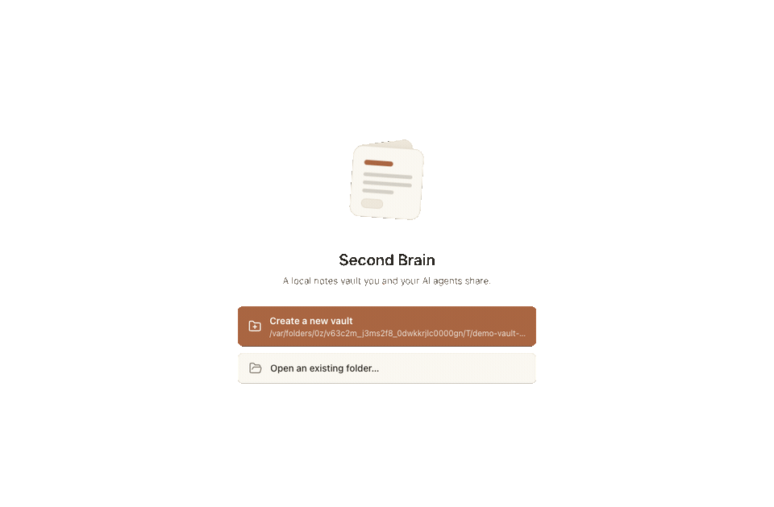

<h1 align="center">Second Brain</h1>

<p align="center">A local-first notes vault you <strong>and your AI agents</strong> share. Your notes stay plain files on your machine — nothing leaves by default.</p>

<p align="center">
  
</p>

---

Second Brain is a cross-platform desktop app for keeping notes in folders you own, edited in a rich [BlockNote](https://www.blocknotejs.org/) editor. Its defining idea: the whole vault is **readable and writable by AI agents** — through a CLI and an MCP server — following rules you define, so you can ask an assistant to "summarise my last 24 hours and file it where it belongs." Full-text + semantic search makes everything findable, for you and for agents.

## Highlights

- **Local-first & private.** Notes are plain `.note.json` files (Markdown import/export everywhere). The search index is derived and rebuildable; nothing is sent off-machine except via an opt-in embedding provider.
- **Rich editor.** BlockNote with inline **Mermaid diagrams**, and **`[[wikilinks]]`** with backlinks.
- **Find anything.** Keyword (SQLite FTS) + optional **semantic search** — including a **built-in on-device model** (EmbeddingGemma), or Ollama / LM Studio / OpenAI / Bedrock. Plus a **knowledge graph** of tag, semantic, and link relationships.
- **Databases.** Turn a folder into a table/board with typed properties — each row is just a note.
- **Agent access.** A `brain` CLI and a `brain-mcp` MCP server (thin shells over one core library), plus one-click install of the vault "contract" into Claude Code / Codex / Gemini, and an owner-editable `RULES.md`.
- **Import.** Drag in `.md`, `.txt`, `.docx`, or `.pdf` and it converts to a note.

## Install

Grab an installer for your platform from the [latest release](https://github.com/muhammaddadu/second-brain/releases) (macOS `.dmg`, Windows `.exe`, Linux `.AppImage`/`.deb`). The app auto-updates from GitHub Releases.

> Builds aren't code-signed yet, so the OS may warn about an "unidentified developer" on first launch.

## Run from source

```sh
pnpm install
pnpm dev                       # launch the desktop app (HMR)
BRAIN_VAULT=/path/to/vault pnpm dev   # point at a scratch vault
```

The `brain` CLI and `brain-mcp` server live in `packages/cli` and `packages/mcp`; the desktop Settings → Agent access screen installs them for you.

## Documentation

- **[docs/README.md](docs/README.md)** — the documentation index (architecture, data model, ADRs, guides).
- **[AGENTS.md](AGENTS.md)** — the guide for working in this repo (humans and agents).
- **[Building & releasing](docs/guides/building-and-releasing.md)** · **[Agent integration](docs/guides/agent-integration.md)** · **[Contributing](CONTRIBUTING.md)**

## Stack

TypeScript throughout — Electron + React + Vite (desktop), a shared `packages/core` for all vault operations, WASM SQLite (FTS5 + vector embeddings) for the derived index, and CLI/MCP surfaces. Built epic-by-epic (E0–E9); see [docs/product/epics](docs/product/epics/index.md).

## License

TBD.
