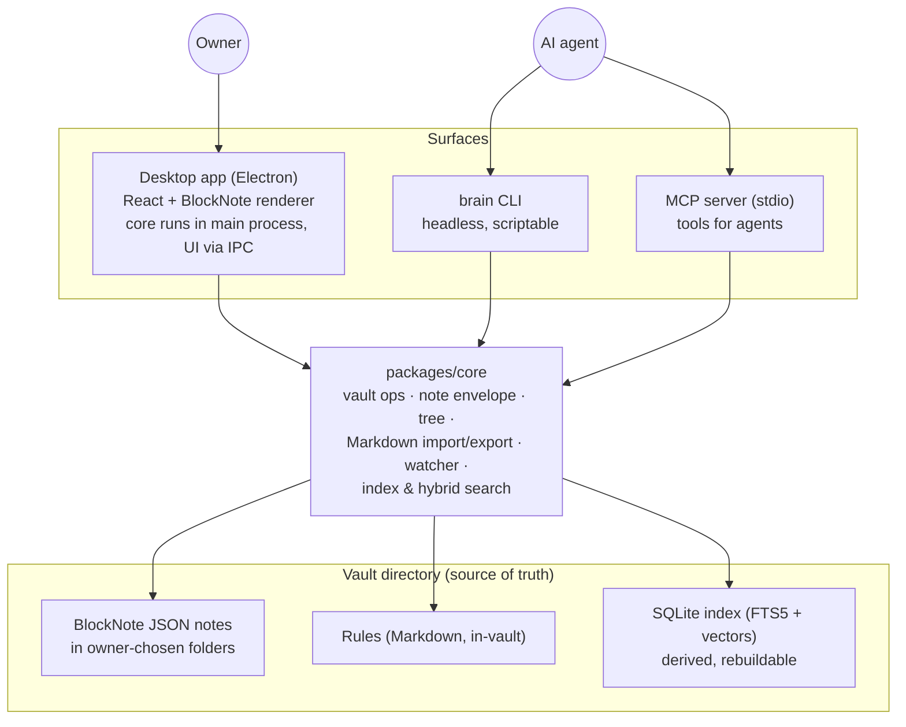

# System Architecture

> **This doc owns:** the system shape — processes, surfaces, data flow, and concurrency. **For code layout see** [app-architecture](app-architecture.md); **for storage formats see** [data-model](data-model.md); **for library choices see** [tech-stack](tech-stack.md).

**Status: partly built** — traces to [PRD §3.3–§3.5](../product/prd.md). The desktop app and core (vault ops, watcher, conflict guard, Markdown import/export) have shipped; the CLI, MCP server, and the index/search leg are still planned.

## Shape

Everything is a shell over one core library; the vault directory on disk is the single source of truth, and the search index is derived from it.

## Key properties

- **One core, three shells.** All vault logic lives in `packages/core`; the app (via IPC from the renderer to the Electron main process), the CLI, and the MCP server are thin adapters. Identical behaviour across surfaces is a PRD requirement (§3.5), not an aspiration.
- **Files first, index derived.** Any process may be the writer; the index updates incrementally from file changes and can always be rebuilt from scratch ([PRD §3.4](../product/prd.md)). Nothing is stored only in the index.
- **Headless-capable.** CLI and MCP server run without the desktop app; agents work on the vault while the app is closed.
- **Local-first.** No network calls in the default configuration ([PRD §4.1](../product/prd.md)); remote embedding providers are opt-in at the core seam.

## Concurrency

Multiple processes (app + agent via CLI/MCP) can touch the vault at once. The mechanism is **atomic write-then-rename with watcher-driven refresh, and SQLite in WAL mode** — decided in E0, rationale in [ADR 0002](../adr/0002-vault-concurrency-atomic-write-rename.md). Each note write goes to a same-directory temp file, is fsync'd, then renamed over the target (atomic → no torn reads); every surface watches the vault and refreshes its view on change; the index runs WAL for safe multi-process access. This primitive guarantees the integrity of each write and records a content hash so a concurrent edit is *detectable*; the never-clobber policy (surface both versions, lose neither) is E3's conflict guard — **implemented**: core `watchVault` + a guarded compare-and-swap save (`updateNoteBlocksGuarded`), with the desktop editor showing Reload / Keep-mine. Advisory locking and a single-writer daemon were considered and rejected — see the ADR.

## What doesn't exist here

No server, no cloud, no deployment target — this is a desktop app plus local processes, which is why there is no `docs/operations/` tree. Packaging/distribution of the app is deferred until after E6 (see [epics](../product/epics/index.md)).
