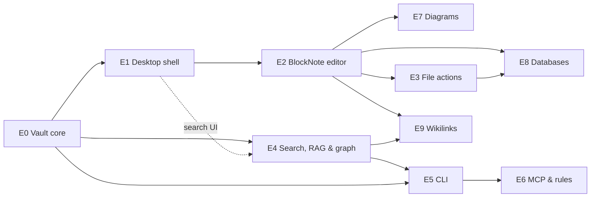

# Epics — Build Plan & Self-Evaluation Index

> **This doc owns:** the build plan — the ordered epics, their dependencies, and how their acceptance criteria are self-evaluated. **For scope see** [PRD](../prd.md); **for modules see** [app architecture](../../architecture/app-architecture.md).

Each **epic** is a shippable slice of scope with its own file, deliverables, and **checkbox acceptance criteria the agent uses to self-evaluate** progress. Epics are ordered because each one's groundwork is what the next builds on.

## How to use these files

- **Pick the next epic** from the table below — don't build ahead of it.
- Each epic file carries **`- [ ]` acceptance criteria** in two groups:
  - **Functional** — what the feature must do, mapped to PRD sections.
  - **E2E validation** — the end-to-end behaviour a test must prove.
- **Self-evaluation:** an epic is *done* only when **every box is checked** and the project's lint/typecheck/test/build all pass. To self-evaluate, read each unchecked box, find the code/test that satisfies it, and either check it (with the evidence) or leave it and explain the gap. Tick a box only when a test or concrete artifact proves it — never on intent.
- **Keep boxes honest.** A checked box without a passing test or shipped artifact is a bug. Criteria are append-friendly: if a requirement surfaces mid-epic, add a box rather than widening an existing one.

## Epics at a glance

Epic IDs are stable (never renumbered); **table order is the build order**.

| Epic | Title | Status | Depends on |
|------|-------|--------|-----------|
| [E0](E0-vault-core.md) | Workspace skeleton & vault core | ✅ Done | — |
| [E1](E1-desktop-shell.md) | Desktop shell & folder navigation | ✅ Done | E0 |
| [E2](E2-blocknote-editor.md) | BlockNote editing & Markdown import/export | ✅ Done | E1 |
| [E7](E7-diagrams.md) | Diagrams as first-class blocks | ✅ Done | E2 |
| [E3](E3-file-actions.md) | File actions & live vault updates | ✅ Done | E2 |
| [E4](E4-search-rag.md) | Search index, RAG & knowledge graph | Done ✓ | E0 (UI parts: E1) |
| [E5](E5-cli.md) | CLI surface | Done ✓ | E0, E4 |
| [E6](E6-mcp-rules.md) | MCP server & vault rules | Done ✓ | E5 |
| [E8](E8-databases.md) | Databases | Done ✓ | E2, E3 |
| [E9](E9-wikilinks.md) | Wikilinks | Done ✓ | E2, E4 |
| [E10](E10-deeper-memory-semantics.md) | Deeper memory semantics | **Proposed** (decide later) | E4, E6, E9 if pursued |

> **E10 is not in the active build order.** It parks reference-inspired ideas (memory status, multi-hop recall UX, richer auto-linking, capture pipelines) so we can accept/reject them without mixing them into the shipped product story. Cloud-hosted memory stays out — see the epic.

## Build order & dependencies

## Testing is first-class

E2E testing is not a final phase and not its own epic — it's a standing requirement woven into every epic. The shared harness (test runner + temp-dir vault fixtures with synthetic notes) lands in E0; every feature epic carries its own E2E criteria and ships the specs that prove them. Core and CLI epics test against a fixture vault; desktop epics add UI-level E2E once E1 establishes the app harness.

## Out of scope

Everything in [PRD §5](../prd.md#5-out-of-scope-v1): sync, mobile, collaboration, agent permission tiers, plugins, publishing. Don't build ahead of the epics.

Proposed post-v1 ideas (not scheduled): [E10 — Deeper memory semantics](E10-deeper-memory-semantics.md).
